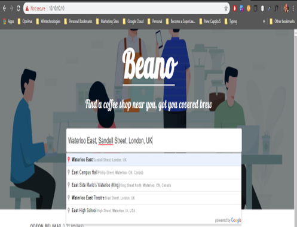

Project requirements**:**
-------------------------

**2x Web servers** -- Hosting a web app (**Beano -- find a cafe near you
using google places API**)

*The webservers will host an app that will dynamically retrieve cafés
within a 500m radius of the location entered in the search input
(**Google Places API**).*

 

**1x Load Balancer** -- Will act as proxy to evenly distribute traffic
to the webservers

 

**Vagrant** -- Will provide the ability to build and provision the
servers with associated files using a simple ***vagrant up*** command
(More information to follow)

 

**Chef** -- Will be used as the infrastructure configuration manager
(cookbooks *no pun*, will be distributed to the servers based on roles
applied to the servers)

**Test Script --** shell script to test the deployed web apps

Pre-requisites
==============

**PLEASE NOTE: In order to achieve a consistent outcome, it is advised
to use the same version stated in this document. The steps shown is on a
windows device, however providing the same tools and versions installed,
should produce the same result.**

Enable virtualisation on PC (Windows Only)
------------------------------------------

This is required to allow the ability of being able to run virtual
machines on your machine. The guide below provides good clear
instructions on how to enable this feature

<https://mashtips.com/enable-virtualization-windows-10/>

VirtualBox -- Installation steps
--------------------------------

**In use version 6.1**

1.  Select \> <https://www.virtualbox.org/wiki/Downloads>

2.  Once downloaded navigate to your downloads folder and run the
    installation

3.  Select **Next** all the way through, if prompted to install network
    interfaces select **Yes**

4.  On The last screen select **Finish** to complete

Vagrant -- Installation steps
-----------------------------

*Vagrant is a tool for building and managing virtual machine
environments in a single workflow. With an easy-to-use workflow and
focus on automation, Vagrant lowers development environment setup time,
increases production parity, and makes the \"works on my machine\"
excuse a relic of the past.*

To summarise why will be using vagrant for this project, is to mainly
speedup the deployment of the virtual machines not having to manually
download an iso mount the drive and repeat this for each server.

With the use of vagrant, you can simply point your
[Vagrantfile]{.underline} to a hosted iso in vagrants repo and easily
spin up a VM with a single command **[vagrant up]{.underline}**
\<optional machine name\>. More details to come as we continue to build
this project.

Manages Virtual machines,

-   Easily create/destroy VMs

-   Start/Stop and restart VMs

-   Access to VMs

-   Networking VM settings

**In use version 2.2.7**

 

1.   Download Vagrant installer from
    <https://www.vagrantup.com/downloads.html> [ ]{.underline} selecting
    your operating system.

2.  Run Vagrant installer, Select **Next** all the way through accepting
    licensing agreements

3.  Once installed if prompted to restart select **Yes**

Vagrant plugins -- ominubus, berkshelf (optional no community cookbooks
used)

Git - Installation steps (Command line Tool)
--------------------------------------------

Git is an opens source version control system used by developers.
Version control systems keep these revisions straight, storing the
modifications in a central repository. This allows developers to easily
collaborate, as they can download a new version of the software, make
changes, and upload the newest revision. Every developer can see these
new changes, download them, and contribute.

Download Git installed from <https://git-scm.com/downloads> 

1.  Once downloaded, the install should be found in your downloads
    folder *c:/users/\<yourusername\>/Downloads*

2.  **Run** The download by double clicking

3.  Select **Next** all the way through (**I Suggest to keep all the
    shortcut options checked**)

Chef-solo and not Chef Server?
==============================

[[https://blog.differentpla.net/blog/2014/11/13/which-chef/]{.underline}](https://blog.differentpla.net/blog/2014/11/13/which-chef/)

Being that the scope of the project is to build a small infrastructure
consisting of 3 servers, I thought it would be best to use chef solo
instead of creating a chef server as it will require a lot more
configuration.

 

Chef-solo is a much lighter version of chef, If I were to use
Chef-server, this will require a workstation that has chef-development
kit installed on it. Chef clients deployed to each server along with
validator certs. Using Chef-solo chef and its required config is
installed independently on the machine to run locally. With the use of
vagrant, I am able to specify the location of the cookbooks and assign
each server chef roles that will be used to deploy the correct
configurations on the servers.

**Manual Install is not required as this will be done at deployment
phase.**

Git Repository -- Clone Project
===============================

Now that we have the tools that will be used out of the way. Next up is
to clone the repository that contains all the vagrant file and
associated project files.

You can either use your command prompt or simply use the terminal
installed with the previous Git Bash install. **Git Bash** **Terminal
used in steps shown**

1.  Select **Start button** \> type (**Git bash**)

2.  {width="5.0in"
    height="1.5798611111111112in"}Select **Git** **bash** you should be
    presented with a terminal screen

3.  Make sure you are in a directory you wish to store the project files
    in. type **pwd** and press enter. This will show you the current
    directory you are in (Git bash usually opens in youre the root of
    your home directory)

> {width="6.167527340332459in"
> height="0.9272123797025372in"}

4.  ***Optional step: if you prefer to load files in your Documents
    folder simply type cd \~/Documents***

5.  Type: **git clone <https://github.com/henry89/projectAL.git> and
    press enter. Desired outcome below**

> 

6.  Navigate to the cloned folder. Type: **cd projectAL**

7.  Providing that the pre-requisites install and setup has been
    completed, you should now be able to simply type: **vagrant up** in
    the terminal window

{width="5.7882206911636045in" height="2.46875in"}

**The install should take around 10 minutes to deploy. Once completed
you should be met with the following screen**

Testing the web App (Web browser)
---------------------------------

-   In your web browser navigate to <https://10.10.10.10>

> You should be presented with the following webpage
>
> 

-   You can now type in and search a location within the input

-   Upon selecting your location, you will be able to see a list off
    cafes with in a 500m radius of the specified address. (Asynchronous
    request -- no page refresh)

> 

Testing the Web App (Shell Script)
----------------------------------

Within the files/folders cloned from the git repository, there is a
directory called scripts in the root folder

1.  **Open** the scripts directory

2.  **Double click** on the **web-health** shell script

The following screen should show with the output results of the test

Providing that requests where successful you should see a success
message of status ok on all checks

*web02/01 192.168.10.11 Status - OK*
